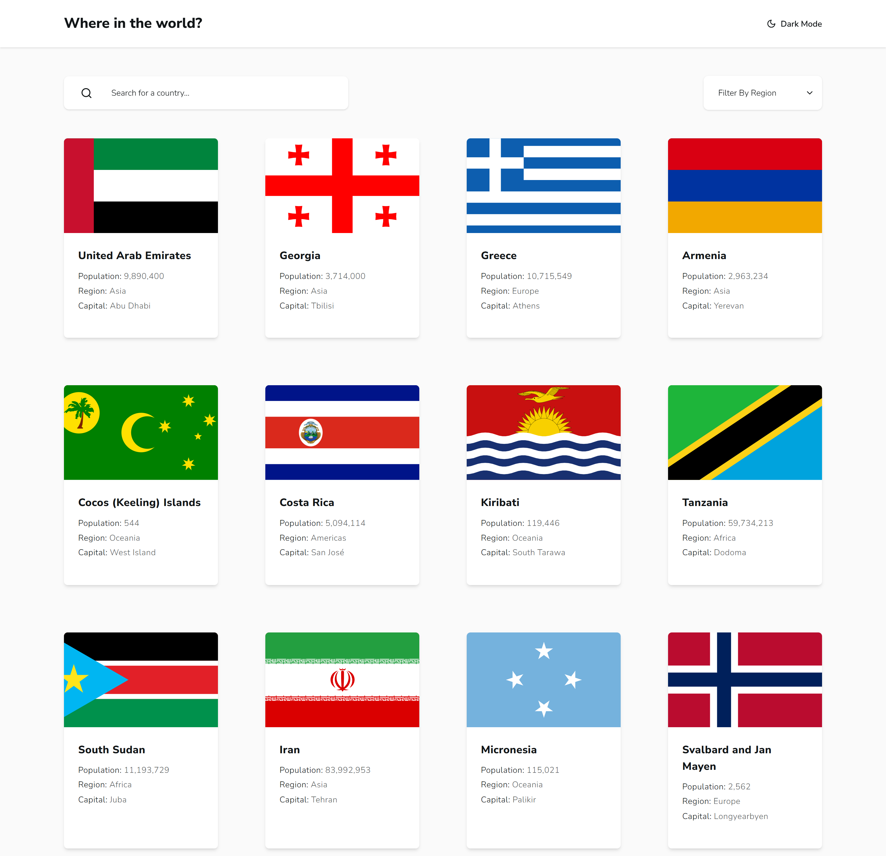

# RestCountries App

A modern [Next.js](https://nextjs.org) application that displays country data using the [Rest Countries API](https://restcountries.com/). Features include search, region filtering, pagination, and light/dark mode.

---



---

## Features

- 🌍 Browse countries with flag, population, region, capital, and more
- 🔎 Search countries by name
- 🗂️ Filter countries by region
- 📄 Paginated country list
- 🌓 Light/Dark theme toggle
- ⚡ Fast client-side navigation

## Tech Stack

- [Next.js](https://nextjs.org/)
- [React](https://react.dev/)
- [Tailwind CSS](https://tailwindcss.com/)
- [Shadcn UI](https://ui.shadcn.com/)
- [Lucide Icons](https://lucide.dev/)
- [Sonner](https://sonner.emilkowal.dev/) for toast notifications

## Getting Started

Install dependencies:

```bash
npm install
```

Run the development server:

```bash
npm run dev
```

Open [http://localhost:3000](http://localhost:3000) in your browser.

## Project Structure

- `src/app/` — Next.js app directory
- `src/components/` — UI and feature components
- `src/lib/` — Context, types, and utilities
- `public/` — Static assets

## Customization

- Change theme colors in [`src/app/globals.css`](src/app/globals.css)
- Update country card UI in [`src/components/CountryList.tsx`](src/components/CountryList.tsx)
- Modify context logic in [`src/lib/CountryContext.tsx`](src/lib/CountryContext.tsx)

## Deployment

Deploy easily on [restcountries-next-ts-shadcn.vercel.app](https://restcountries-next-ts-shadcn.vercel.app/)
